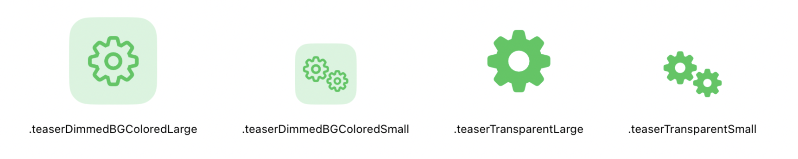
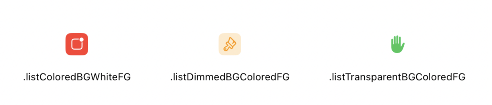
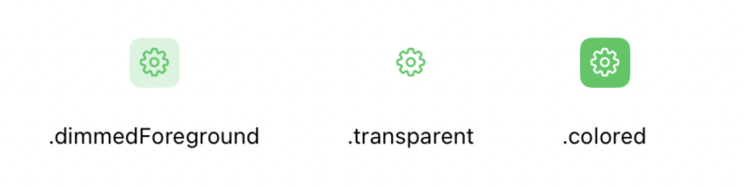
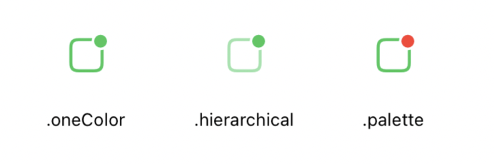
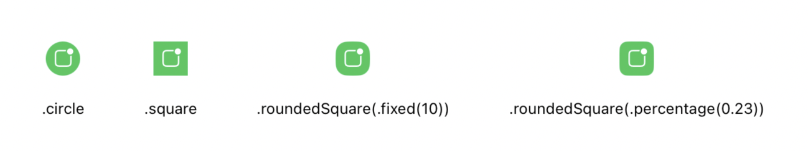

# PizzaIcon


Reusable views for working with icons.

## Examples

### Presets
Teaser presets - for using in empty/error views.


List presets - for use in lists (for ex. UITableView)


### Customization

Background


Foreground


Shape


## Installation

### SPM

```swift
dependencies: [
    .package(url: "https://github.com/PizzaKit/pizzaicon", .upToNextMajor(from: "1.0.0"))
]
```

## How to use

Use `PizzaIconView` for `UIKit` or `PizzaSUIIconView` for `SwiftUI`.

### shouldBounce
Flag indicating if icon should bounce on appearance and on user's tap (animation available in iOS 17+).

### Preset
```swift
PizzaSUIIconView(
    icon: PizzaIcon(sfSymbol: .gearshape)
        .apply(
            preset: .teaserDimmedBGColoredLarge,
            color: .tintColor
        ),
    shouldBounce: true
)
```
### Custom

```swift
PizzaSUIIconView(
    icon: PizzaIcon(sfSymbol: .gearshape)
        .foreground(.oneColor(.white))
        .background(.colored(.tintColor))
        .shape(.roundedSquare(.percentage(0.23))),
    shouldBounce: true
)
```
